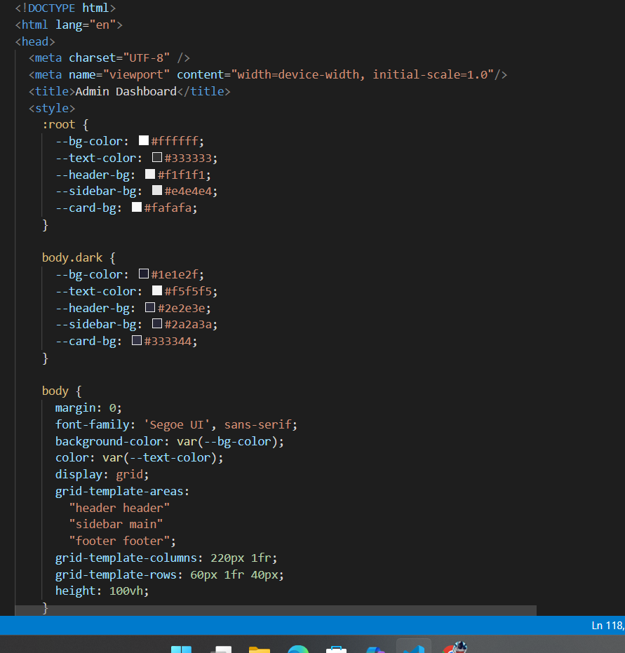
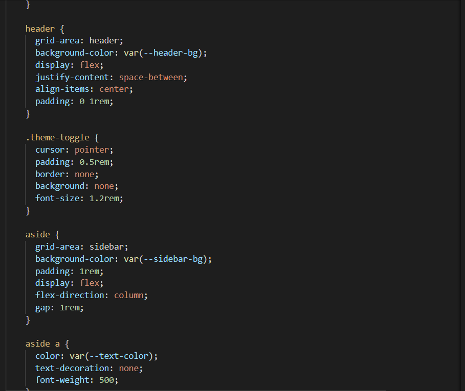
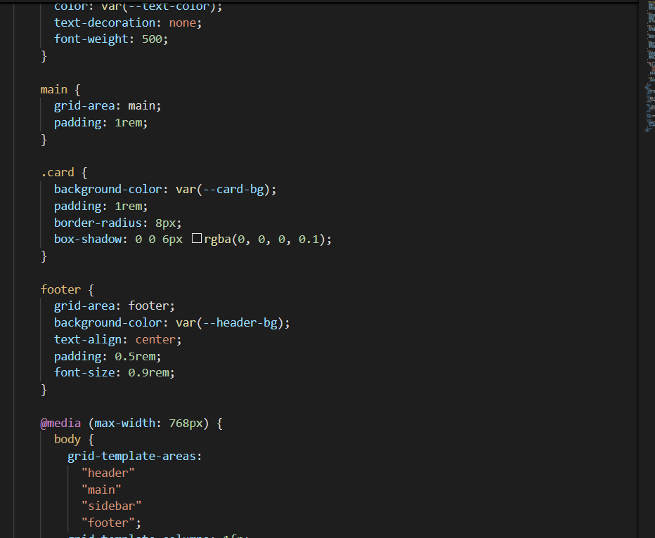
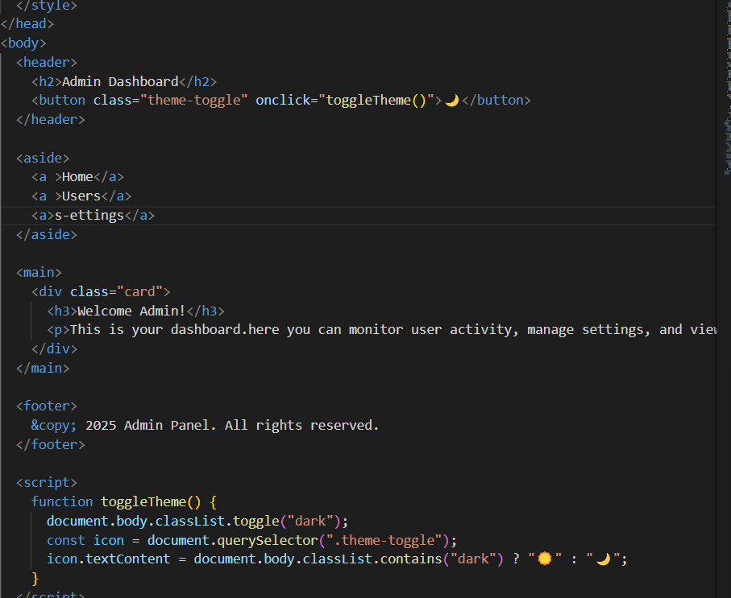
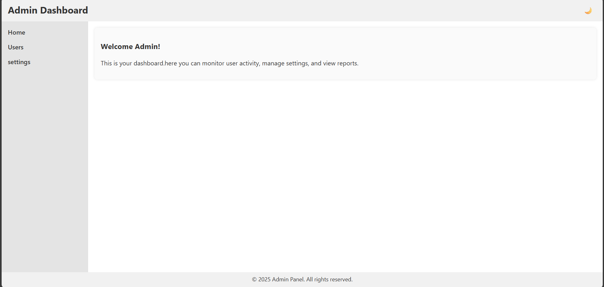
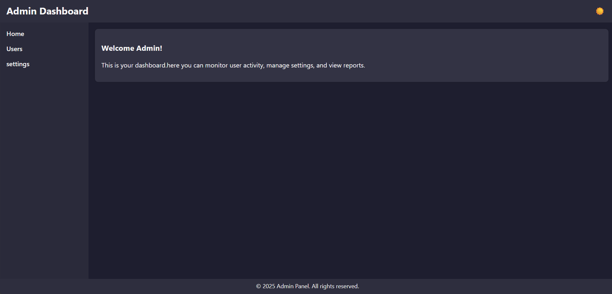

# Admin Dashboard with CSS Grid Layout and Theme Switching

## Objective

Design and build a **professional, responsive admin dashboard** using:

- **HTML & CSS Grid** for layout
- **JavaScript** for theme switching (Light/Dark mode)

The dashboard features:

- A **Header** with dashboard title and theme toggle
- A **Sidebar** with navigation links (Home, Users, Settings)
- A **Main Content Area** for data or reports
- A **Footer** with copyright

---

---

### Code Screenshot

### Output Screenshot (Light Mode)

### Output Screenshot (Dark Mode)

---

## Features

- CSS Grid layout for responsive UILearning Outcomes
By completing this project, you will:

Master CSS Grid for advanced layout control

Implement JavaScript-based dynamic theme switching

Understand CSS variables for easy theming

Create responsive and accessible UI components
- Theme switch (Light/Dark) using JavaScript
- Dynamic theming without page reload
- Mobile-friendly and professional design

---
